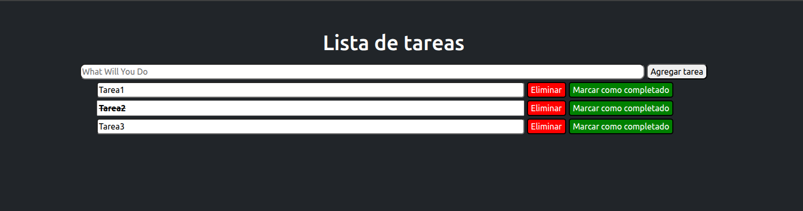

# 📝 To-Do List con JavaScript y DOM
Este proyecto es una simple aplicación de lista de tareas (*To-Do List*) creada usando **HTML**, **CSS** y **JavaScript**, enfocada en el manejo del **DOM (Document Object Model)** para añadir, eliminar y marcar tareas como completadas.
## 🚀 Funcionalidades
- Agregar tareas.
- Marcar tareas como completadas.
- Eliminar tareas.
## 🧠 Tecnologías utilizadas
- HTML5
- CSS3
- JavaScript (DOM)
## 📂 Estructura del proyecto

